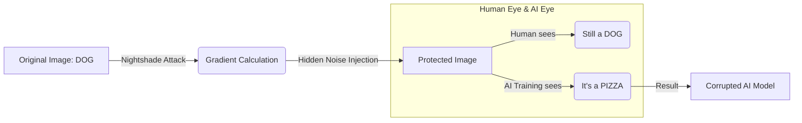
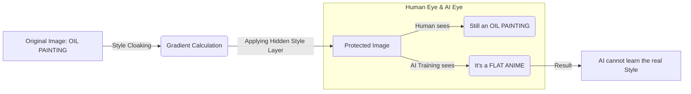

# Hope-AD: Advanced Adversarial Defense Mechanism

The **Hope-AD** (Hope Adversarial Defense) project provides a set of image copyright protection tools designed to combat unintended exploitation by Generative AI models (Stable Diffusion, LoRA, etc.). The system integrates two defense methods based on adversarial perturbations, namely **Nightshade** and **Glaze**.

**Current Version:** 1.1.1

> [!NOTE]
>
> **Download Installer (Windows Installer):**
>
> [Google Drive Link](https://drive.google.com/drive/folders/1HCHGcMTn8I07X_6m4h1vv75ZJML2jzQM?usp=drive_link)
>
> [MediaFire Link](https://www.mediafire.com/file/rv5nzhu0aa7gbm2/hope_ad_setup_v1.1.1_win10-11x64.zip/file)

## Hardware Configuration (Windows 10/11 64-bit):

| Hardware Description | Minimum            | Recommended             |
| -------------------- | ------------------ | ----------------------- |
| CPU                  | Intel Core i7 3770 | Intel Core i5 8400      |
| Memory/RAM           | 8GB                | 16GB+                   |
| GPU                  | Not required       | NVIDIA GeForce GTX 1080 |
| Storage              | 128GB              | 512GB                   |

---

## 1. Theoretical Foundation & Operating Mechanism

Hope-AD utilizes convex optimization principles on the latent space of Diffusion Models to create perturbations that are imperceptible to the human eye but have a strong enough impact on the training and machine learning processes.

### 1.1. Nightshade: Concept Poisoning

**Objective:** Causes "Model Mode Collapse" or "Concept Bleeding" when an AI model attempts to learn from protected data. Nightshade transforms the semantic connection (Context Link) between the image and its descriptive text.



**Mathematical Model:**
Suppose $x$ is the original image, $c_{source}$ is the source concept (e.g., \"dog\"), and $c_{target}$ is the target concept (e.g., \"cat\"). We seek an optimal perturbation $\delta$ that minimizes the following objective function:

$$ \min_{\delta} || \mathcal{E}(x+\delta) - \mathcal{E}(x_{target}) ||_2^2 + \lambda ||\delta||_p $$

Where:

- $\mathcal{E}(\cdot)$ is the mapping function of the Feature Extractor (e.g., CLIP Vision Encoder).
- $x_{\text{target}}$ is the anchor image representing $c_{\text{target}}$.
- $\lVert \delta \rVert_p$ is the $L_p$ norm constraint (usually $L_\infty$ or $L_2$) to ensure perceptual quality.

**Effectiveness:** When a model is fine-tuned on Nightshade-poisoned data, gradient descent optimizes the model weights in a misleading direction, corrupting the feature representation of that concept.

<div align="center">
  <table border="1" width="100%">
    <thead>
      <tr>
        <th align="center" width="15%">Description</th>
        <th align="center" width="42%">Before</th>
        <th align="center" width="42%">After</th>
      </tr>
    </thead>
    <tbody>
      <tr>
        <td align="center"><strong>Case 1</strong></td>
        <td align="center">
          
        </td>
        <td align="center">
          
        </td>
      </tr>
      <tr>
        <td align="center"><strong>Case 2</strong></td>
        <td align="center">
          
        </td>
        <td align="center">
          
        </td>
      </tr>
      <tr>
        <td colspan="3" align="left" style="padding: 10px;">
          <strong>Explanation:</strong>
          <ul>
            <li><strong>Nightshade:</strong> LoRAs trained in the \"Before\" cases use clean, unpoisoned images and generate normal outputs via TXT2IMG. However, the Nightshade-poisoned outputs in the \"After\" cases result in distorted, deviated images...</li>
            <li><strong>Model (checkpoint):</strong> counterfeitV30_30</li>
            <li><strong>LoRA 1 (Clean):</strong> clean_10 (clean)</li>
            <li><strong>LoRA 2 (NaiXay):</strong> Naixay_10 (poisoned)</li>
            <li><strong>SPM:</strong> DPM++ 2MSDE</li>
            <li><strong>Prompt:</strong> 1 girl, solo, hair ornament</li>
            <li><strong>Prompt LoRA 1:</strong> 1 girl, solo, hair ornament, &lt;LoRA:clean:2&gt; fcc_clean</li>
            <li><strong>Prompt LoRA 2:</strong> 1 girl, solo, hair ornament, &lt;LoRA:naixay:2&gt; fcc_naixay</li>
            <br>
            <li>
              <strong>Note:</strong>
              <p>This is the result after feeding poisoned images into the AI; the desired result is that the AI cannot replicate and even misunderstands the original image.</p>
            </li>
          </ul>
        </td>
      </tr>
    </tbody>
  </table>
</div>

<br>
<br>

<div align="center">
  <table border="1" width="100%">
    <thead>
      <tr>
        <th align="center" width="20%">Status</th>
        <th align="center" width="40%">Case 1</th>
        <th align="center" width="40%">Case 2</th>
      </tr>
    </thead>
    <tbody>
      <tr>
        <td align="center"><strong>Before</strong></td>
        <td align="center">
          
        </td>
        <td align="center">
          
        </td>
      </tr>
      <tr>
        <td align="center"><strong>After</strong></td>
        <td align="center">
          
        </td>
        <td align="center">
          
        </td>
      </tr>
      <tr>
        <td colspan="3" align="left" style="padding: 10px;">
          <strong>Explanation:</strong>
          <ul>
            <li><strong>Glaze:</strong> LoRAs trained in the \"Before\" cases use clean, unpoisoned images and generate normal outputs via IMG2IMG. However, the Nightshade-poisoned outputs in the \"After\" cases result in distorted, deviated images...</li>
            <li><strong>Model (checkpoint):</strong> counterfeitV30_30</li>
            <li><strong>LoRA 1 (Clean):</strong> clean_10 (clean)</li>
            <li><strong>LoRA 2 (glaze):</strong> glaze_10 (cloaked)</li>
            <li><strong>SPM:</strong> DPM++ 2MSDE</li>
            <li><strong>Prompt:</strong> 1 girl, solo</li>
            <li><strong>Prompt LoRA 1:</strong> 1 girl, solo, &lt;LoRA:clean:2&gt; fcc_clean</li>
            <li><strong>Prompt LoRA 2:</strong> 1 girl, solo, &lt;LoRA:glaze:2&gt; fcc_glaze</li>
            <br>
            <li>
              <strong>Note:</strong>
              <p>This is the result after feeding poisoned images into the AI; the desired result is that the AI cannot replicate and even misunderstands the original image.</p>
            </li>
          </ul>
        </td>
      </tr>
    </tbody>
  </table>
</div>

<br>

### 1.2. Glaze: Style Cloaking

**Objective:** Prevent style mimicry by creating a Feature Shift in the representation space.



**Mathematical Model:**
Glaze optimizes $\delta$ to push the image representation in the latent space towards an opposite style $S_{target}$, while maintaining the semantic content $C$.

$$ \min*{\delta} [ \mathcal{L}*{style}(\Phi(x+\delta), \Phi(S*{target})) + \alpha \mathcal{L}*{content}(\Psi(x+\delta), \Psi(x)) ] $$

Where:

- $\Phi(\cdot)$ is the Style Extractor (e.g., Gram matrices of VGG layers).
- $\Psi(\cdot)$ is the Content Extractor.
- $\alpha$ is the balance coefficient between cloak robustness and image quality.

As a result, the AI model will \"see\" an entirely different style (e.g., Anime $\to$ Abstract), making it harder to mimic the original style.

<div align="center">
  <table border="1" width="100%">
    <thead>
      <tr>
        <th align="center">Description</th>
        <th align="center">Before</th>
        <th align="center">After</th>
      </tr>
    </thead>
    <tbody>
      <tr>
        <td align="center"><strong>Case 1</strong></td>
        <td align="center">
          
        </td>
        <td align="center">
          
        </td>
      </tr>
      <tr>
        <td align="center"><strong>Case 2</strong></td>
        <td align="center">
          
        </td>
        <td align="center">
          
        </td>
      </tr>
      <tr>
        <td colspan="3" align="left" style="padding: 10px;">
          <strong>Explanation</strong>
          <ul>
            <li>
              <strong>Glaze:</strong> The original (Clean) image works normally with IMG2IMG. Conversely, the Glaze-processed image contains a \"style cloak\" noise layer that causes the AI to completely misunderstand the context, leading to mangled outputs and loss of original artistic details.
            </li>
            <br>
            <li>
              <strong>Note:</strong>
              <p>This is the result after feeding Glaze-protected images into the AI; the desired result is that the AI cannot replicate it.</p>
            </li>
          </ul>
        </td>
      </tr>
    </tbody>
  </table>
</div>

---

## 2. Installation Guide (For Devs)

If you are a developer and want to develop or run the source code directly from Python (instead of using the .exe file), please follow this standardized process:

**Requirements:**

- Python 3.10+
- NVIDIA GPU (VRAM $\ge$ 6GB recommended)
- CUDA Toolkit compatible with your PyTorch version.

**Process:**

1.  **Initialize Virtual Environment:**
    To ensure dependency isolation, use `venv`:

    ```bash
    python -m venv venv
    .\venv\Scripts\activate
    ```

2.  **Install Libraries:**

    ```bash
    pip install --upgrade pip
    pip install -r requirements.txt
    ```

    _Note: This process will download `torch`, `diffusers`, `transformers`, and other necessary libraries._

3.  **Operation:**
    To launch the User Interface (GUI) via the Python wrapper (if available) or use the CLI engine directly:
    ```bash
    python engine.py --help
    ```

---

## 3. Copyright & Disclaimer

This project is developed with the goal of protecting the intellectual property rights of content creators in the AI era.

- **Source Code:** Owned by HopeADeff.
- **Liability:** Users are responsible for using this tool for legal purposes. We are not responsible for any misuse.

---

_Document last updated: 12/2025_

---

## 4. New Features & Improvements (v1.1)

### 4.1. Delta Injection - Preserving Original Image Details

**Old Issue:** Previous protection methods processed at 512px resolution and then upscaled, often blurring details.

**Delta Injection Solution:**

Instead of replacing the entire image, we only **extract the protection noise (Delta)** and **inject** it into the original image:

```
Delta (δ) = Protected_Image_512px - Original_Image_Resized_512px
Final_Image = Original_Image + Upscale(Delta)
```

**Advantages:**

- ✅ Preserves 100% of the original image details
- ✅ Adds only a thin layer of protection noise
- ✅ Works with any resolution (4K, 8K...)

**Reference:** [Residual Learning (He et al., 2015)](https://arxiv.org/abs/1512.03385)

---

### 4.2. Render Quality

A new slider allows for adjusting **processing time** vs **protection level**:

| Level | Name          | Iterations | Time      |
| ----- | ------------- | ---------- | --------- |
| 1     | Fast          | 50         | ~20 mins  |
| 2     | **Default**   | 100        | ~40 mins  |
| 3     | Slow          | 200        | ~80 mins  |
| 4     | Slowest       | 250        | ~160 mins |

> **Note:** This feature applies to both Glaze and Nightshade.

---

### 4.3. Side-by-Side Deployment Architecture

**Old Issue:** Packaging a 4GB model into a single .exe file → C drive overflow during extraction.

**Solution:**

```
Hope-AD/
├── Hope.exe           ← UI (~50MB)
└── engine/
    ├── engine.exe     ← Backend (~200MB)
    └── assets/models/ ← AI Models (~4GB, direct read)
```

**Advantages:** No C drive usage, faster startup (probably), can be installed on any drive.

---

### 4.4. HuggingFace Fallback

If the local model is missing, the system automatically downloads from `runwayml/stable-diffusion-v1-5`. Download once, cache forever.

---

| Method                  | Target Vector             | Effectiveness                                                                                   |
| ----------------------- | ------------------------- | ----------------------------------------------------------------------------------------------- |
| **Adversarial Noise**   | High-frequency noise      | **Low**: Easily removed by denoising and image compression.                                    |
| **Nightshade (Poison)** | Concept deviation         | **Recommended**: Causes catastrophic forgetting or concept deviation in model weights.          |
| **Glaze (Cloak)**       | Style feature conversion  | **Recommended**: Effective against Style Transfer and LoRA fine-tuning.                         |

> **In summary**:
>
> \"Nightshade and Glaze are the two options we encourage using for the best results.\" - _Noah_
>
> \"lmao\" - _QD_

## Frequently Asked Questions (FAQ)

### Q: Effectiveness on small datasets (Few-Shot Learning)?

**A: High effectiveness.** Fine-tuning diffusion models (like LoRA or DreamBooth) is very sensitive to the quality of small datasets ($N \approx 5-20$). If the **Poison Ratio** is high (e.g., 100% of the training set is poisoned), gradients will continuously diverge from the global minimum, leading to **Overfitting on Poisoned Features**.

### Q: Why do Img2Img/Interrogation still work?

**A: The difference between Training (Backpropagation) and Inference (Forward Pass).**

- **Inference**: The model acts as a \"Denoising Autoencoder.\" Strong denoising strength ($>0.5$) or IP-Adapter guidance can reconstruct image content because the noise is designed to be semi-imperceptible.
- **Training**: The optimization process minimizes the loss function based on the _poisoned_ latent features. The model updates weights to map image concept \"A\" to malicious target \"B.\" Since Hope-AD attacks the **Gradient Descent** process, it is specifically designed to disrupt training, not image viewing.

### Q: Image Integrity vs. Protection Intensity?

A: The tool uses an optimization algorithm to keep changes at the lowest level (almost invisible to the human eye). However, with a high `Intensity` setting, slight graininess may appear.

### Q: What Intensity level is suitable (similar to 80-90% of the original)?

**Recommendations:**

- **Very similar to original (95%+)**: `0.05` (5%) -> Suitable if you want the image to maintain maximum beauty.
- **Recommended (Balanced)**: `0.08 - 0.10` (8-10%) -> Balance between protection and aesthetics (~90% similar).
- **Strong Protection**: `0.15+` -> Slight noise may appear, but offers better protection.

### Q: Why do advanced AI models (Gemini Banana Pro, GPT-4o, etc.) still generate a complete concept from images using my protection method?

**A: This is the difference between Training and Inference:**

1. **Inference (Image Generation/Img2Img)**: When you provide an image for the AI to redraw, the AI has very strong **denoising** capabilities. It can see through a thin Glaze layer to reconstruct the outlines. **Glaze is NOT designed to block this.**
2. **Training (Style Mimicry)**: This is the primary purpose of Glaze. If someone uses your Glazed image to **Train a LoRA**, that model will be corrupted (learning noise or cubist styles instead of the original painting).

=> **Conclusion**: It is normal for AI to still \"see\" the character to redraw it (i2i). Glaze protects you from having your **style stolen** to create a custom Model.

### Q: How does Nightshade interfere with my work?

A: **[Nightshade works similarly to Glaze](https://nightshade.cs.uchicago.edu/whatis.html)**

But instead of being a defensive measure against style mimicry, it is designed as an offensive tool to distort feature representations within generative image AI models. Like Glaze, Nightshade is calculated based on a multi-objective optimization process to minimize visible changes compared to the original image. While the human eye sees the processed image as almost unchanged, the AI model sees a completely different composition within that image.

### Q: Is the reliability of this software high?

A: **Trust, but not absolute.**

1.  **Mathematically**: Hope-AD uses the same core algorithm (Projected Gradient Descent) as the original version from the University of Chicago (Glaze/Nightshade Team). So the attack effectiveness is equivalent.
2.  **Practically**:
    - **High efficiency (80-90%)**: With popular models like Stable Diffusion 1.5, SDXL, NAI (Anime).
    - **Lower efficiency**: With models that are too new or have very different architectures (Midjourney v6, DALL-E 3, Gemini Banana Pro, GPT-4o, etc.) - as they do not publish their source code for attacks.
3.  **Sincere advice**: No tool provides 100% protection. Hope-AD is like a high-quality \"door lock\" for your artistic home. It blocks most curious individuals who download images to train (the majority). However, if you encounter an expert intentionally picking the lock, it's very difficult. But don't worry, your paintings haven't reached the level of being targeted by major corporations yet. Just use it to create with peace of mind!

### Q: When will it be released on other platforms?

A: Porting an app based on the WPF/CSharp platform to Android, iOS, MacOS (x64/ARM) is currently **too far** beyond the team's capabilities, especially in terms of optimization. However, appearing on other operating systems will still be feasible, as the team's main maintainer, Noah, already has experience writing desktop and mobile apps using JavaScript, so transitioning from CSharp to pure JS will only be a matter of time, though performance issues will certainly remain as it will still depend entirely on Python for AI logic, backend, etc.

## Disk Space

| Version                        | Size          | Notes                                                            |
| ------------------------------ | ------------- | ---------------------------------------------------------------- |
| **Installer (.exe)**           | **~2.76 MB**  | Does not include necessary Python binaries, environment, etc.    |
| **Source Code**                | **~1 MB**     | Does not include venv                                            |
| **Installer (Full/.exe/.bin)** | **~3.63 GB**  | Both the main `setup.exe` and dependencies                       |
| **Installed (Full)**           | **~4.68 GB**  | Complete app including .NET and Python environments, UI, logic   |

## References & Credits

The project is built based on scientific research:

- **Nightshade**: [Shawn Shan et al., \"Nightshade: Prompt-Specific Poisoning Attacks on Text-to-Image Generative Models\"](https://arxiv.org/abs/2310.13828)
  - _Reference details_: **Section 4 (Attack Design)**, pp. 6-8. Describes the optimization process for poisoning concepts in the latent space.
- **Glaze**: [Shawn Shan et al., \"Glaze: Protecting Artists from Style Mimicry by Text-to-Image Models\"](https://arxiv.org/abs/2302.04222)
  - _Reference details_: **Section 3 (Style Cloaking)**, pp. 4-6. Explains the style shift perturbation method.
- **CLIP**: [OpenAI, \"Learning Transferable Visual Models From Natural Language Supervision\"](https://github.com/openai/CLIP)
  - _Reference details_: **Section 3.1 (Image Encoder)**, pp. 5-6. Basis for feature extraction used in our loss functions.
- **High-Resolution Image Synthesis with Latent Diffusion Models**: [Rombach et al., CVPR 2022](https://arxiv.org/abs/2112.10752)
  - _Reference details_: **Section 3 (Method)**, pp. 4-9. Architecture of the Stable Diffusion model (UNet + VAE) used in the backend.
- **Towards Deep Learning Models Resistant to Adversarial Attacks**: [Madry et al., ICLR 2018](https://arxiv.org/abs/1706.06083)
  - _Reference details_: **Section 2 (Saddle Point Problem)**, pp. 2-4. Defines the Projected Gradient Descent (PGD) algorithm, the core mathematical solver for Hope-AD.
- **Mist**: [Liang et al., \"Mist: Towards Improved Adversarial Examples for Diffusion Models\"](https://arxiv.org/abs/2305.12683)
  - _Reference details_: **Section 3.2 (Texture-based Attack)**, p. 5. Similar approach to our \"Noise\" method.
- **Adversarial Example Generation for Diffusion Models (AdvDM)**: [Liang et al., 2023](https://arxiv.org/abs/2305.16494)
  - _Reference details_: **Section 3 (Methodology)**, pp. 4-6. Illustrates direct adversarial noise optimization on the latent reverse process.
- **Anti-DreamBooth**: [Le et al., ICCV 2023](https://arxiv.org/abs/2303.15433)
  - _Reference details_: **Section 3.1 (Defense Framework)**, pp. 4-5. Discusses targeted noise optimization to disrupt \"DreamBooth\" fine-tuning.
- **The Unreasonable Effectiveness of Deep Features as a Perceptual Metric (LPIPS)**: [Zhang et al., CVPR 2018](https://arxiv.org/abs/1801.03924)
  - _Reference details_: **Section 3**, pp. 3-5. Defines the Learned Perceptual Image Patch Similarity (LPIPS) metric used to ensure protected images look identical to the original (Visual Quality Preservation).

## Special Thanks

- [Noah Trần](https://github.com/Coder-Blue)
- [Nguyễn Trí Nhân](https://www.facebook.com/nguyen.ala.142)
