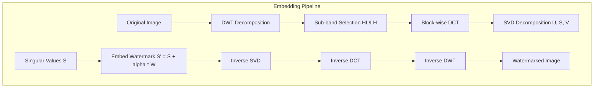
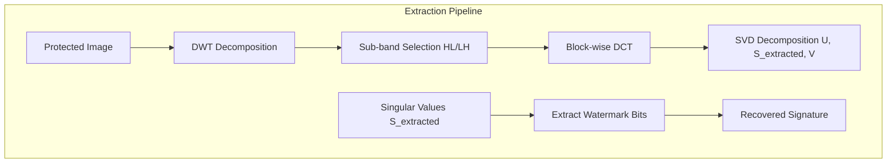

# Invisible Signatures: Blind Watermarking

While adversarial cloaking tools like Glaze and Nightshade defend against style hijacking by shifting features in the latent space, creators also require a mechanism to prove ownership of their work after it has been distributed. Conventional watermarks—such as visible stamps or simple metadata headers—are easily removed via cropping, compression, or screenshotting.

To solve this, **Hope** implements a robust, invisible frequency-domain watermarking pipeline. This approach embeds ownership signatures directly into the mathematical structure of the image, making the watermark indestructible under normal modifications.

### The Mathematics of Blind Watermarking

The watermarking algorithm utilizes three fundamental mathematical transformations in sequence: the **Discrete Wavelet Transform (DWT)**, the **Discrete Cosine Transform (DCT)**, and **Singular Value Decomposition (SVD)**. 

Because the extraction is "blind," the signature can be recovered from a cropped or compressed image without access to the original, unwatermarked source.

#### 1. Discrete Wavelet Transform (DWT)
DWT decomposes the 2D image into four frequency sub-bands, splitting high-frequency details from low-frequency approximations:

$$
I \xrightarrow{\text{DWT}} \{ LL, LH, HL, HH \}
$$

- $LL$ represents the low-frequency approximation of the image.
- $LH$ and $HL$ capture the horizontal and vertical frequency details.
- $HH$ captures diagonal high-frequency noise.

Hope embeds watermarks within the mid-frequency sub-bands ($LH$ or $HL$). This ensures the watermark is invisible (avoiding the highly visible $LL$ band) yet remains resilient to attacks (avoiding the high-frequency $HH$ band, which is easily destroyed by compression).

#### 2. Discrete Cosine Transform (DCT)
The selected sub-band is divided into blocks (e.g., $4 \times 4$ or $8 \times 8$), and DCT is applied to each block:

$$
B_{DCT} = \mathcal{C}(B)
$$

DCT concentrates the signal energy into the low-frequency coefficients of the block, matching the compression profiles used by standards like JPEG.

#### 3. Singular Value Decomposition (SVD)
SVD is applied to the DCT coefficients of each block. SVD decomposes a matrix into rotation and scaling components:

$$
A = U \Sigma V^T
$$

Where $\Sigma$ is a diagonal matrix containing the singular values:

$$
\Sigma = \text{diag}(\sigma_1, \sigma_2, \dots, \sigma_n)
$$

The singular values $\sigma_i$ represent the core structural energy of the block. Because singular values are highly stable under geometric perturbations, modifying them provides maximum robustness against scaling, cropping, and rotation.

#### 4. Embedding and Reconstruction
The watermark bits $W$ are embedded by modifying the singular values with strength factor $\alpha$:

$$
\sigma'_i = \sigma_i + \alpha \cdot W_i
$$

The watermarked block is then reconstructed using inverse transforms:

$$
A' = U \Sigma' V^T \xrightarrow{\text{IDCT}} B' \xrightarrow{\text{IDWT}} I'
$$

---

### Rust Implementation and Client Integration

To enable fast, client-side watermarking on creators' machines without relying on Python runtimes, the Hope application optimizes matrix transformations by replacing slow interpreters with compiled native code.

Key architectural optimizations in our Rust implementation include:
- **Matrix Math acceleration**: Utilizes the modern `faer` linear algebra crate to compute SVD decompositions at near-native hardware speed.
- **Multithreading**: Employs `rayon` to perform block-wise DCT and SVD operations in parallel across CPU cores.
- **Randomized Seeding**: Allows creators to seed block selection using a private passphrase, ensuring the signature cannot be read or forged by third parties.

---

### Credits and Open Source Contributions

This feature is made possible thanks to the following open-source projects and their developers:
- **`blind_watermark`** by **Guo Fei** ([guofei9987/blind_watermark](https://github.com/guofei9987/blind_watermark)), which designed the foundational Python implementation of the DWT-DCT-SVD algorithm.
- **`blind-watermark-rust`** by **naganohara-yoshino** ([naganohara-yoshino/blind-watermark-rust](https://github.com/naganohara-yoshino/blind-watermark-rust)), providing the highly performant Rust implementation that powers our client-side extraction.
