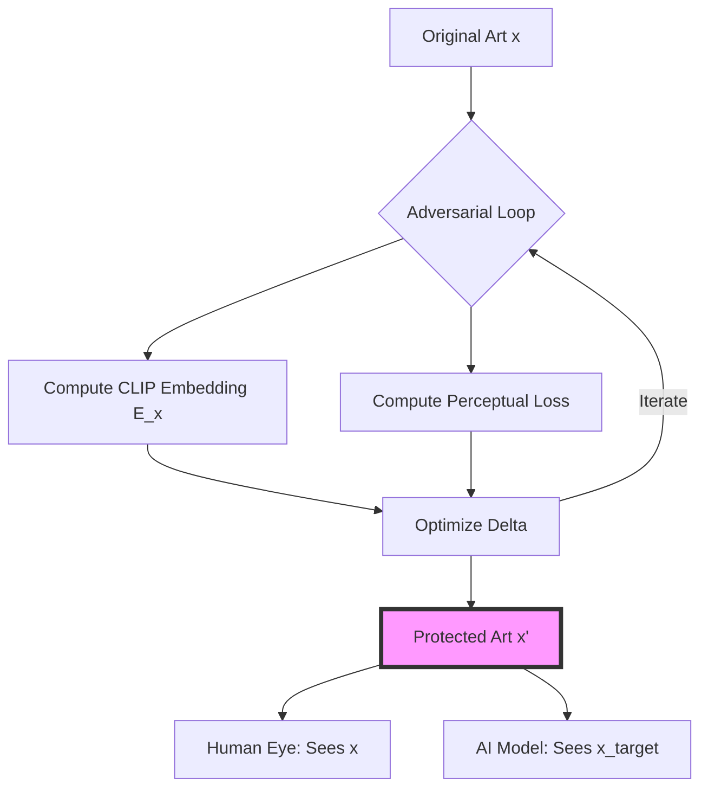

# Understanding Hope: The Mathematics of Artistic Defense

To a human, an image is a collection of colors, textures, and emotions. To a machine learning model, an image is a point in a high-dimensional manifold—a latent vector. This dissonance between human perception and machine encoding is the foundation of **Hope**.

The rapid emergence of generative AI has created a unique threat to artistic sovereignty. When models are trained on scraped data, they don't just "see" the art; they internalize the underlying statistical distributions of an artist's style and concepts. Hope operates within the delta of this representation, utilizing sophisticated adversarial perturbations to protect creators.

This project is built upon the groundbreaking research of the **Glaze Project at the University of Chicago**. We credit the fundamental algorithms to their work, specifically the foundational paper: [*Glaze: Protecting Artists from Style Mimicry by Text-to-Image Models* (arXiv:2302.04222)](https://arxiv.org/abs/2302.04222).

### The Geometry of Perturbation

At its core, Hope solves an adversarial optimization problem. For an original artwork $x$, we seek to generate a perturbation $\delta$ to create a protected image $x' = x + \delta$. The objective is to shift the representation of $x$ in the model's feature space to match a target style or concept $x_{target}$, while ensuring the visual difference remains imperceptible to humans.

The optimization objective can be expressed as:

$$
\min_{\delta} \mathcal{D}(E(x + \delta), E(x_{target})) + \lambda \cdot \text{PerceptualLoss}(x, x + \delta)
$$

Subject to the constraint:
$$
||\delta||_{p} \leq \epsilon
$$

Where:
- **$E(\cdot)$**: The latent encoder (e.g., CLIP).
- **$\mathcal{D}(\cdot)$**: A distance metric in the feature space.
- **$\lambda$**: A balancing coefficient for visual fidelity.
- **$\epsilon$**: The maximum allowed perturbation magnitude (typically under the $L_{\infty}$ norm).

By minimizing this objective, we create what researchers call an **unlearnable image**. The table below summarizes the three primary protection mechanisms implemented in the `hope-algorithms` repository:

| Mechanism | Target | Effect on AI |
| :--- | :--- | :--- |
| **Noise** | Feature Extraction | Disrupts general pattern recognition and style extraction. |
| **Glaze** | Style Manifold | Cloaks the artist's unique style by mimicking a target style in latent space. |
| **Nightshade** | Conceptual Mapping | "Poisons" the model's understanding of specific concepts (e.g., dog $\rightarrow$ cat). |

### Hijacking the Encoder

The "bridge" between text prompts and pixels in models like Stable Diffusion is the **CLIP (Contrastive Language-Image Pre-training)** encoder. Hope hijacks this bridge by creating a feature-space mismatch.

When an AI model is fine-tuned or trained on $x'$, it associates the artist's identity not with their actual style, but with the target features encoded in $\delta$. This turns the act of training into an act of corruption—the more the model tries to "learn," the more its internal concept mapping is distorted.

### Engineering the Shield: JAX & Pipelines

The implementation in the [hope-algorithms](https://github.com/HopeArtOrg/hope-algorithms) repository utilizes **JAX** and **Jupyter Notebooks** to manage this high-iteration optimization process.

#### Why JAX?
Adversarial attacks are computationally expensive. Generating an optimal $\delta$ requires hundreds of iterations of backpropagation through a deep neural network (CLIP). JAX provides:
- **XLA Compilation**: Compiling python functions into highly optimized machine code.
- **Functional Autograd**: Efficient gradient computation via `jax.grad` and `jax.jit`.
- **Vectorization**: Using `jax.vmap` to process multiple tiles or images in parallel.

#### The Development Pipeline
The repository is structured as a sequential pipeline within Jupyter Notebooks, facilitating a research-to-production flow:
1. **Model Conversion**: Converting CLIP weights from PyTorch to JAX-compatible formats.
2. **Algorithm Tuning**: Iteratively refining the SPSA-PGD (Simultaneous Perturbation Stochastic Approximation - Projected Gradient Descent) loops.
3. **Tiling Mechanism**: Processing high-resolution images by breaking them into $224 \times 224$ patches to fit within VRAM constraints.
4. **ONNX Export**: Exporting the final optimized models to ONNX format for cross-platform execution in the [Hope:RE](https://github.com/HopeArtOrg/hope-re) desktop app.

### The Next Horizon: Hemlock

Protection is an arms race. As AI companies develop adaptive countermeasures (such as "perturbation washing" filters), the algorithms must evolve. The next phase of this research is the **Hemlock Project**.

Hemlock aims to provide a unified, resilient protection layer that is specifically optimized for the latest generation of diffusion models (like SDXL and Flux). It focuses on increasing the "durability" of perturbations against image processing attacks while maintaining even lower visual impact.

### Conclusion

Precision is our greatest form of protection. By understanding and exploiting the mathematical boundaries of machine learning, we can return technology to its rightful place: as a tool that serves the creator, not a parasite that consumes them.

---

Thank you for exploring the technical heart of Hope. To dive deeper into the code or contribute to the research, visit the [hope-algorithms](https://github.com/HopeArtOrg/hope-algorithms) repository.
