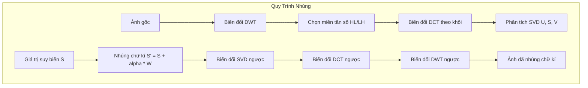
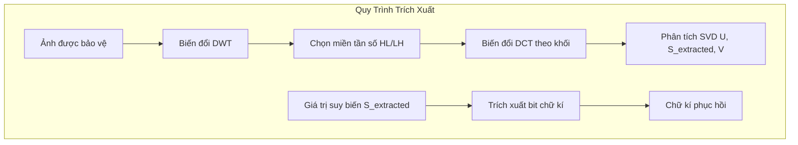

# Chữ Kí Ẩn: Thuật Toán Nhúng Chữ Kí Miền Tần Số Trong Hope

Trong khi các công cụ làm nhiễu đối kháng như Glaze và Nightshade bảo vệ phong cách nghệ thuật bằng cách thay đổi đặc trưng trên không gian tiềm ẩn (latent space), nghệ sĩ vẫn cần một cơ chế để chứng minh quyền sở hữu tác phẩm sau khi công bố. Các loại watermark truyền thống—như dấu logo đóng đè hoặc siêu dữ liệu (metadata)—rất dễ bị loại bỏ khi cắt xén (cropping), nén ảnh, hoặc chụp lại màn hình.

Để giải quyết vấn đề này, **Hope** tích hợp quy trình nhúng chữ kí ẩn trong miền tần số. Phương pháp này giấu chữ kí sở hữu sâu vào cấu trúc toán học của ảnh, giúp chữ kí tồn tại bền vững trước các thao tác chỉnh sửa thông thường.

### Toán Học Đằng Sau Chữ Kí Ẩn (Blind Watermarking)

Thuật toán nhúng chữ kí ẩn thực hiện chuỗi biến đổi toán học tuần tự bao gồm: **Biến đổi Wavelet rời rạc (DWT)**, **Biến đổi Cosin rời rạc (DCT)**, và **Phân tích giá trị suy biến (SVD)**.

Nhờ tính chất "blind" (trích xuất mù), chữ kí có thể được phục hồi từ ảnh đã bị cắt xén hoặc nén mà không cần so sánh với ảnh gốc ban đầu.

#### 1. Biến đổi Wavelet rời rạc (DWT)
DWT phân tách ảnh 2 chiều thành bốn miền tần số, chia nhỏ các chi tiết tần số cao khỏi phần xấp xỉ tần số thấp:

$$
I \xrightarrow{\text{DWT}} \{ LL, LH, HL, HH \}
$$

- $LL$ đại diện cho phần xấp xỉ tần số thấp của ảnh.
- $LH$ và $HL$ ghi nhận các chi tiết tần số trung bình theo chiều ngang và dọc.
- $HH$ ghi nhận nhiễu tần số cao theo đường chéo.

Hope nhúng chữ kí vào các miền tần số trung bình ($LH$ hoặc $HL$). Lựa chọn này đảm bảo chữ kí vô hình trước mắt người (tránh miền $LL$ quá rõ ràng) nhưng vẫn bền bỉ trước các cuộc tấn công (tránh miền $HH$ dễ bị phá hủy khi nén ảnh).

#### 2. Biến đổi Cosin rời rạc (DCT)
Miền tần số được chọn sẽ chia thành các khối (ví dụ: $4 \times 4$ hoặc $8 \times 8$), sau đó áp dụng biến đổi DCT cho từng khối:

$$
B_{DCT} = \mathcal{C}(B)
$$

DCT tập trung năng lượng tín hiệu vào một số ít hệ số tần số thấp của khối, tương thích với cơ chế nén của chuẩn JPEG.

#### 3. Phân tích giá trị suy biến (SVD)
SVD được áp dụng trên các hệ số DCT của mỗi khối. Phép phân tích SVD phân rã ma trận thành các thành phần quay và co giãn:

$$
A = U \Sigma V^T
$$

Trong đó $\Sigma$ là ma trận đường chéo chứa các giá trị suy biến:

$$
\Sigma = \text{diag}(\sigma_1, \sigma_2, \dots, \sigma_n)
$$

Các giá trị suy biến $\sigma_i$ đại diện cho năng lượng cấu trúc cốt lõi của khối ảnh. Do các giá trị này cực kỳ ổn định trước các biến đổi hình học, việc tinh chỉnh chúng giúp chữ kí chống chịu tốt nhất trước các thao tác co giãn, cắt xén và xoay ảnh.

#### 4. Nhúng Chữ Ký và Tái Tạo Ảnh
Các bit chữ kí $W$ được nhúng bằng cách thay đổi các giá trị suy biến với hệ số lực nhúng $\alpha$:

$$
\sigma'_i = \sigma_i + \alpha \cdot W_i
$$

Khối ảnh sau khi nhúng được tái tạo qua các phép biến đổi ngược:

$$
A' = U \Sigma' V^T \xrightarrow{\text{IDCT}} B' \xrightarrow{\text{IDWT}} I'
$$

---

### Triển Khai Bằng Rust và Tích Hợp Hệ Thống

Để chữ kí ẩn được xử lý trực tiếp, nhanh chóng trên thiết bị của nghệ sĩ mà không cần cài đặt môi trường Python phức tạp, ứng dụng Hope tối ưu hóa việc biến đổi ma trận thông qua mã máy biên dịch gốc.

Các tối ưu hóa cấu trúc nổi bật trong bản Rust bao gồm:
- **Tốc độ xử lý ma trận**: Sử dụng crate đại số tuyến tính `faer` để tính phân rã SVD với tốc độ phần cứng tối ưu.
- **Xử lý đa luồng**: Tận dụng thư viện `rayon` để chạy các phép biến đổi DCT và SVD song song trên tất cả lõi CPU.
- **Khóa bảo mật ngẫu nhiên**: Cho phép người dùng tạo hạt giống ngẫu nhiên hóa vị trí nhúng dựa trên mật khẩu riêng, ngăn chặn bên thứ ba tự ý đọc trộm hoặc làm giả chữ kí ẩn của tác giả.

---

### Ghi nhận Đóng góp và Mã nguồn mở

Tính năng này được hoàn thiện nhờ đóng góp từ các thư viện mã nguồn mở và các nhà phát triển:
- **`blind_watermark`** phát triển bởi **Guo Fei** ([guofei9987/blind_watermark](https://github.com/guofei9987/blind_watermark)), tác giả thuật toán nhúng chữ kí ẩn DWT-DCT-SVD trên Python.
- **`blind-watermark-rust`** phát triển bởi **naganohara-yoshino** ([naganohara-yoshino/blind-watermark-rust](https://github.com/naganohara-yoshino/blind-watermark-rust)), cung cấp bản Rust hiệu năng cao phục vụ xử lý trực tiếp trên ứng dụng Hope.
