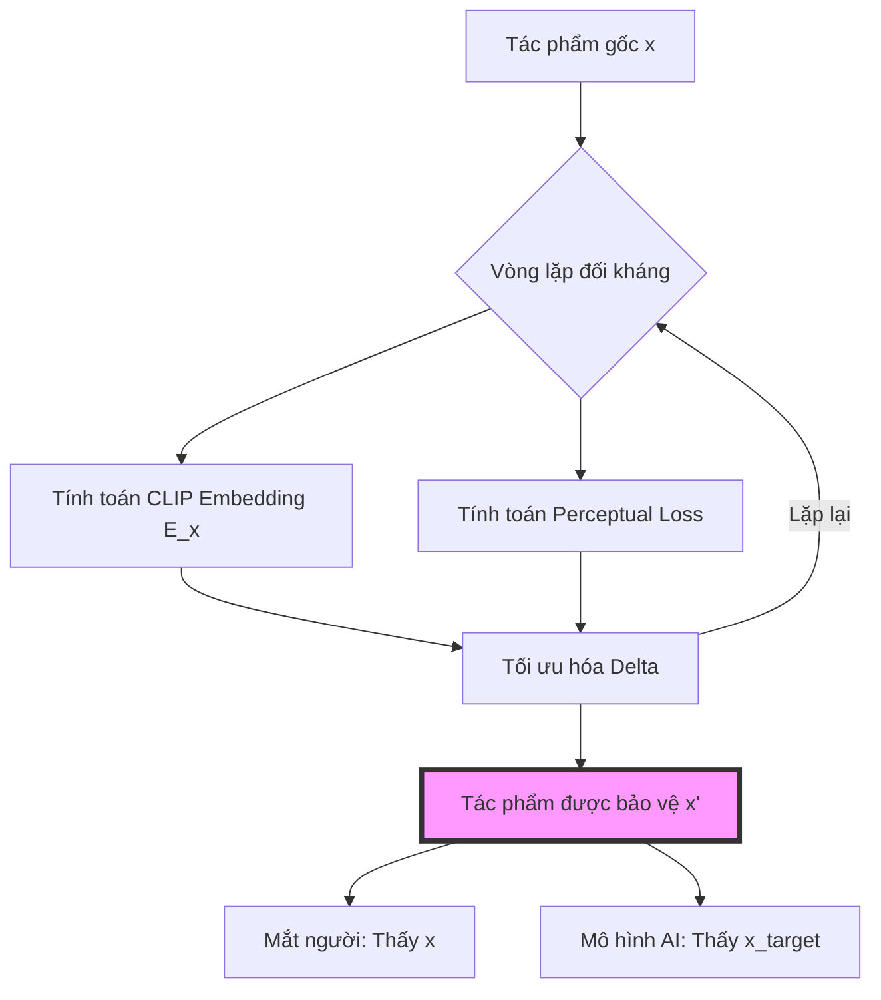

# Thấu Hiểu Hope: Toán Học Của Sự Bảo Vệ Nghệ Thuật

Đối với con người, một bức tranh là sự kết hợp của màu sắc, chất liệu và cảm xúc. Đối với một mô hình học máy (machine learning), hình ảnh lại là một điểm trong một đa tạp cao chiều—một vector tiềm ẩn (latent vector). Sự bất đồng giữa nhận thức của con người và cách mã hóa của máy móc chính là nền tảng của **Hope**.

Sự trỗi dậy mạnh mẽ của AI tạo hình đã tạo ra một mối đe dọa đặc biệt đối với quyền tự quyết nghệ thuật. Khi các mô hình được huấn luyện trên dữ liệu bị thu thập trái phép, chúng không chỉ "xem" tác phẩm; chúng nội tại hóa các phân phối thống kê về phong cách và khái niệm của người nghệ sĩ. Hope vận hành trong chính khoảng cách của sự biểu diễn này, sử dụng các nhiễu đối kháng (adversarial perturbations) tinh vi để bảo vệ những người sáng tạo.

Dự án này được xây dựng dựa trên những nghiên cứu đột phá của **Dự án Glaze tại Đại học Chicago**. Chúng tớ xin dành sự tri ân về các thuật toán nền tảng cho công trình của họ, đặc biệt là bài báo nghiên cứu: [*Glaze: Protecting Artists from Style Mimicry by Text-to-Image Models* (arXiv:2302.04222)](https://arxiv.org/abs/2302.04222).

### Hình Học Của Sự Nhiễu Loạn

Về cốt lõi, Hope giải quyết một bài toán tối ưu hóa đối kháng. Đối với một tác phẩm gốc $x$, chúng tớ tìm cách tạo ra một nhiễu $\delta$ để tạo thành một hình ảnh được bảo vệ $x' = x + \delta$. Mục tiêu là dịch chuyển sự biểu diễn của $x$ trong không gian đặc trưng (feature space) của mô hình sao cho khớp với một phong cách hoặc khái niệm mục tiêu $x_{target}$, trong khi vẫn đảm bảo sự khác biệt về mặt thị giác là không thể nhận ra đối với con người.

Hàm mục tiêu tối ưu hóa có thể được biểu diễn như sau:

$$
\min_{\delta} \mathcal{D}(E(x + \delta), E(x_{target})) + \lambda \cdot \text{PerceptualLoss}(x, x + \delta)
$$

Dưới điều kiện ràng buộc:
$$
||\delta||_{p} \leq \epsilon
$$

Trong đó:
- **$E(\cdot)$**: Bộ mã hóa tiềm ẩn (ví dụ: CLIP).
- **$\mathcal{D}(\cdot)$**: Một phép đo khoảng cách trong không gian đặc trưng.
- **$\lambda$**: Hệ số cân bằng cho độ trung thực về thị giác.
- **$\epsilon$**: Cường độ nhiễu tối đa cho phép (thường theo chuẩn $L_{\infty}$).

Bằng cách tối ưu hóa hàm này, chúng tớ tạo ra cái mà các nhà nghiên cứu gọi là **hình ảnh không thể học được (unlearnable image)**. Bảng dưới đây tóm tắt ba cơ chế bảo vệ chính được triển khai trong kho lưu trữ `hope-algorithms`:

| Cơ chế | Mục tiêu | Tác động lên AI |
| :--- | :--- | :--- |
| **Noise** | Trích xuất đặc trưng | Làm rối loạn quá trình nhận diện quy luật và trích xuất phong cách tổng quát. |
| **Glaze** | Đa tạp phong cách | Che giấu phong cách độc bản bằng cách mô phỏng một phong cách mục tiêu trong không gian tiềm ẩn. |
| **Nightshade** | Bản đồ khái niệm | "Đầu độc" sự hiểu biết của mô hình về các khái niệm cụ thể (ví dụ: chó $\rightarrow$ mèo). |

### Chiếm Quyền Điều Khiển Bộ Mã Hóa

"Cây cầu" nối giữa các câu lệnh văn bản (text prompts) và điểm ảnh trong các mô hình như Stable Diffusion chính là bộ mã hóa **CLIP (Contrastive Language-Image Pre-training)**. Hope chiếm quyền điều khiển cây cầu này bằng cách tạo ra sự sai lệch trong không gian đặc trưng.

Khi một mô hình AI được tinh chỉnh (fine-tuned) hoặc huấn luyện trên $x'$, nó sẽ liên kết danh tính của nghệ sĩ không phải với phong cách thực tế của họ, mà với các đặc trưng mục tiêu được mã hóa trong $\delta$. Điều này biến hành động huấn luyện thành hành động phá hủy—mô hình càng cố gắng "học", bản đồ khái niệm nội tại của nó càng bị biến dạng.

### Kỹ Thuật Đằng Sau Lá Chắn: JAX & Pipeline

Việc triển khai trong kho lưu trữ [hope-algorithms](https://github.com/HopeArtOrg/hope-algorithms) sử dụng **JAX** và **Jupyter Notebooks** để quản lý quy trình tối ưu hóa với số lượng vòng lặp lớn này.

#### Tại sao lại là JAX?
Các cuộc tấn công đối kháng tiêu tốn rất nhiều tài nguyên tính toán. Việc tạo ra một nhiễu $\delta$ tối ưu đòi hỏi hàng trăm vòng lặp lan truyền ngược (backpropagation) thông qua một mạng thần kinh sâu (CLIP). JAX cung cấp:
- **Biên dịch XLA**: Biên dịch các hàm python thành mã máy được tối ưu hóa cực cao.
- **Tự động tính đạo hàm (Autograd)**: Tính toán gradient hiệu quả thông qua `jax.grad` và `jax.jit`.
- **Vector hóa**: Sử dụng `jax.vmap` để xử lý song song nhiều mảng ảnh (tiles) hoặc nhiều hình ảnh cùng lúc.

#### Quy trình phát triển
Kho lưu trữ được cấu trúc như một pipeline tuần tự trong các Jupyter Notebook, tạo điều kiện thuận lợi cho luồng từ nghiên cứu đến sản xuất:
1. **Chuyển đổi mô hình**: Chuyển đổi trọng số CLIP từ PyTorch sang định dạng tương thích với JAX.
2. **Tinh chỉnh thuật toán**: Tinh chỉnh lặp đi lặp lại các vòng lặp SPSA-PGD (Simultaneous Perturbation Stochastic Approximation - Projected Gradient Descent).
3. **Cơ chế chia nhỏ (Tiling)**: Xử lý hình ảnh độ phân giải cao bằng cách chia nhỏ thành các mảng $224 \times 224$ để phù hợp với giới hạn VRAM.
4. **Xuất ONNX**: Xuất các mô hình đã tối ưu hóa cuối cùng sang định dạng ONNX để thực thi đa nền tảng trong ứng dụng máy tính [Hope:RE](https://github.com/HopeArtOrg/hope-re).

### Chân Trời Tiếp Theo: Hemlock

Bảo vệ là một cuộc chạy đua vũ trang. Khi các công ty AI phát triển các biện pháp đối phó thích ứng (như bộ lọc "rửa nhiễu"), các thuật toán phải tiến hóa. Giai đoạn tiếp theo của nghiên cứu này là **Dự án Hemlock**.

Hemlock hướng tới việc cung cấp một lớp bảo vệ thống nhất, có khả năng phục hồi cao, được tối ưu hóa đặc biệt cho thế hệ mô hình khuếch tán (diffusion models) mới nhất (như SDXL và Flux). Dự án tập trung vào việc tăng cường "độ bền" của nhiễu trước các cuộc tấn công xử lý ảnh trong khi vẫn duy trì tác động thị giác ở mức thấp hơn nữa.

### Kết Luận

Sự chính xác là hình thức bảo vệ tốt nhất của chúng tớ. Bằng cách thấu hiểu và khai thác các ranh giới toán học của học máy, chúng tớ có thể đưa công nghệ trở về đúng vị trí của nó: một công cụ phục vụ người sáng tạo, chứ không phải một ký sinh trùng tiêu thụ họ.

---

Cảm ơn các cậu đã cùng chúng tớ khám phá trái tim kỹ thuật của Hope. Để tìm hiểu sâu hơn về mã nguồn hoặc đóng góp cho nghiên cứu, hãy ghé thăm kho lưu trữ [hope-algorithms](https://github.com/HopeArtOrg/hope-algorithms).
