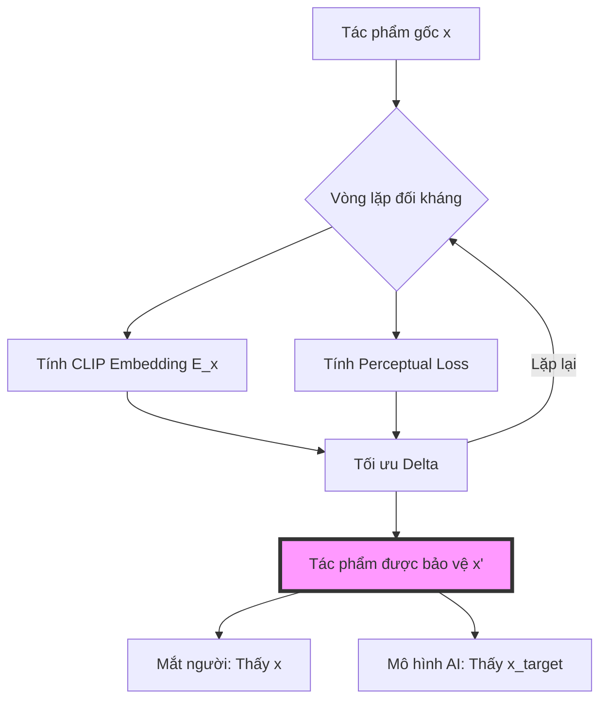

# Bên Trong Hope: Thuật Toán Bảo Vệ Nghệ Thuật

Với con người, một bức tranh là hòa quyện của màu sắc, chất liệu và cảm xúc. Nhưng với một mô hình học máy (machine learning), hình ảnh chỉ là một điểm trong đa tạp cao chiều—một vector tiềm ẩn (latent vector). Chính khoảng cách giữa nhận thức con người và cách máy móc mã hóa đã tạo nên nền tảng cho **Hope**.

Trỗi dậy của AI tạo hình mang đến mối đe dọa trực tiếp cho quyền tự quyết nghệ thuật. Khi các mô hình học từ dữ liệu thu thập trái phép, chúng không chỉ "xem" tác phẩm mà còn nội tại hóa các quy luật thống kê về phong cách và khái niệm của nghệ sĩ. Hope vận hành trong chính sai số biểu diễn này, dùng các nhiễu đối kháng (adversarial perturbations) tinh vi để bảo vệ người sáng tạo.

Dự án này kế thừa những nghiên cứu đột phá từ **Dự án Glaze tại Đại học Chicago**. Chúng tớ tri ân các thuật toán nền tảng từ công trình của họ, đặc biệt là bài báo: [*Glaze: Protecting Artists from Style Mimicry by Text-to-Image Models* (arXiv:2302.04222)](https://arxiv.org/abs/2302.04222).

### Hình Học Nhiễu Loạn

Về cốt lõi, Hope giải quyết bài toán tối ưu hóa đối kháng. Từ một tác phẩm gốc $x$, chúng tớ tạo ra nhiễu $\delta$ để có hình ảnh được bảo vệ $x' = x + \delta$. Mục tiêu là dịch chuyển biểu diễn của $x$ trong không gian đặc trưng (feature space) sao cho khớp với một phong cách hoặc khái niệm mục tiêu $x_{target}$, đồng thời giữ cho thay đổi thị giác ở mức mắt người không thể nhận ra.

#### 1. Glaze: Style Cloaking
Glaze giảm thiểu khoảng cách giữa embedding phong cách của ảnh được bảo vệ và một phong cách mục tiêu $S_{target}$, trong khi vẫn bảo toàn nội dung gốc $x$.

$$
\min_{\delta} || \Phi(x + \delta) - \Phi(S_{target}) ||_2^2 + \lambda \cdot \text\{LPIPS\}(x, x + \delta)
$$
Ràng buộc: $||\delta||_{\infty} \leq \epsilon$

Trong đó $\Phi(\cdot)$ trích xuất các đặc trưng phong cách (ví dụ: qua Gram matrices hoặc bộ mã hóa phong cách chuyên biệt).

#### 2. Nightshade: Concept Poisoning
Nightshade nhắm vào căn chỉnh ngữ nghĩa bằng cách đẩy embedding thị giác CLIP của $x$ về phía một khái niệm hoàn toàn khác biệt $x_{target}$.

$$
\min_{\delta} || E(x + \delta) - E(x_{target}) ||_2^2 + \lambda \cdot \text\{PerceptualLoss\}(x, x + \delta)
$$
Ràng buộc: $||\delta||_{p} \leq \epsilon$

#### 3. Noise: Feature Disruption
Một lớp nhiễu tần số cao được thiết kế để phá vỡ tính nhất quán của kết cấu cục bộ mà các bộ mã hóa AI dựa vào để trích xuất đặc trưng.

$$
\min_{\delta} \sum_{i,j} \text\{Var\}(patch_{i,j}(x + \delta)) \quad \text\{s.t.\} \quad ||\delta||_{p} \leq \epsilon
$$

Bằng cách tối ưu hóa các hàm này, chúng tớ tạo ra **hình ảnh không thể học được (unlearnable image)**.

### Chiếm Quyền Điều Khiển Bộ Mã Hóa

"Cây cầu" nối giữa văn bản và điểm ảnh trong các mô hình như Stable Diffusion chính là bộ mã hóa **CLIP (Contrastive Language-Image Pre-training)**. Hope chiếm quyền điều khiển cây cầu này bằng cách tạo ra sai lệch trong không gian đặc trưng.

Khi mô hình AI được tinh chỉnh hoặc huấn luyện trên $x'$, nó liên kết danh tính của nghệ sĩ với các đặc trưng mục tiêu được mã hóa trong $\delta$, thay vì phong cách thực tế. Điều này biến quá trình huấn luyện thành quá trình phá hủy—mô hình càng cố "học", bản đồ khái niệm nội tại của nó càng bị sai lệch.

### Kỹ Thuật Đằng Sau Lá Chắn: JAX & Pipeline

Kho lưu trữ [hope-algorithms](https://github.com/HopeArtOrg/hope-algorithms) sử dụng **JAX** và **Jupyter Notebooks** để quản lý quy trình tối ưu hóa phức tạp này.

#### Tại sao lại là JAX?
Tấn công đối kháng đòi hỏi năng lực tính toán lớn. Tạo ra nhiễu $\delta$ tối ưu cần hàng trăm vòng lặp lan truyền ngược qua mạng thần kinh sâu. JAX mang lại:
- **Biên dịch XLA**: Chuyển các hàm python thành mã máy tối ưu hóa cực cao.
- **Tự động tính đạo hàm (Autograd)**: Tính gradient hiệu quả qua `jax.grad` và `jax.jit`.
- **Vector hóa**: Dùng `jax.vmap` để xử lý song song nhiều mảng ảnh hoặc nhiều hình ảnh.

#### Quy trình phát triển
Kho lưu trữ được cấu trúc thành một pipeline tuần tự:
1. **Chuyển đổi mô hình**: Đưa trọng số CLIP từ PyTorch sang định dạng tương thích JAX.
2. **Tinh chỉnh thuật toán**: Hoàn thiện các vòng lặp SPSA-PGD (Simultaneous Perturbation Stochastic Approximation - Projected Gradient Descent).
3. **Cơ chế chia nhỏ (Tiling)**: Xử lý ảnh độ phân giải cao bằng cách chia nhỏ thành các mảng $224 \times 224$ để phù hợp giới hạn VRAM.
4. **Xuất ONNX**: Đưa mô hình đã tối ưu hóa sang định dạng ONNX để chạy đa nền tảng trên ứng dụng [Hope:RE](https://github.com/HopeArtOrg/hope-re).

### Chân Trời Tiếp Theo: Hemlock

Bảo vệ là một cuộc chạy đua vũ trang. Khi các công ty AI phát triển các biện pháp đối phó (như bộ lọc "rửa nhiễu"), thuật toán phải tiến hóa. Giai đoạn tiếp theo là **Dự án Hemlock**.

Hemlock hướng tới lớp bảo vệ thống nhất, bền bỉ, được tối ưu cho thế hệ mô hình khuếch tán mới nhất (như SDXL và Flux). Dự án tập trung tăng cường "độ bền" của nhiễu trước các cuộc tấn công xử lý ảnh mà vẫn giữ tác động thị giác ở mức tối thiểu.

### Kết Luận

Chính xác là hình thức bảo vệ tốt nhất của chúng tớ. Bằng cách thấu hiểu và khai thác các ranh giới thuật toán của học máy, chúng tớ đưa công nghệ về đúng vị trí: công cụ phục vụ người sáng tạo, không phải ký sinh trùng tiêu thụ họ.

---

Cảm ơn các cậu đã cùng chúng tớ khám phá trái tim kỹ thuật của Hope. Để tìm hiểu sâu hơn về mã nguồn hoặc đóng góp cho nghiên cứu, hãy ghé thăm kho lưu trữ [hope-algorithms](https://github.com/HopeArtOrg/hope-algorithms).
